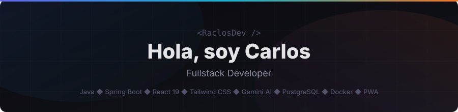

  

    

  
  
  

  

## 🚀 Lo que he construido
> Proyectos personales fullstack, desde la idea hasta producción.

 

### 🟠 [Ascension Tracker](https://ascension.raclos.es) — *Fitness, Nutrición & IA*
PWA 100% nativa (Workbox Offline) para el seguimiento de entrenamientos y nutrición. Integra un **asistente de IA (Gemini)** que estima pesos y macros procesando **fotos de tus platos**. Incluye un constructor de rutinas *Drag & Drop*, notificaciones push en background, escáner de código de barras y mapa de calor muscular interactivo.

  <code>🤖 IA Visión (Reconocimiento fotos)</code> 
  <code>📱 PWA Offline (Workbox)</code> 
  <code>🏋️ Workout Builder Drag&Drop</code> 
  <code>🔔 Push Notifications</code> 

  
  
  
  
  
  

  <a href="https://ascension.raclos.es">Demo en vivo</a> | <a href="https://github.com/RaclosDev/ascension-tracker">Código fuente</a>

 

### 🔵 [LoopDeck](https://loopdeck.raclos.es) — *Repetición Espaciada Inteligente*
Plataforma de flashcards con algoritmo SM-2 y **múltiples modos de estudio** interactivos. Incorpora un motor de IA que permite **generación masiva** de tarjetas, imágenes automáticas vía Wikipedia y un **Tutor IA conversacional**. Soporta sub-mazos anidados y previsualización nativa de archivos **.docx** para extraer apuntes directamente.

  <code>🤖 Tutor IA & Generador Flash</code> 
  <code>📄 Visor de apuntes DOCX</code> 
  <code>🧠 Modos de estudio</code> 
  <code>📚 Sub-mazos anidados</code> 

  
  
  
  
  
  

  <a href="https://loopdeck.raclos.es">Demo en vivo</a> | <a href="https://github.com/RaclosDev/loopdeck">Código fuente</a>

 

### 🟢 [MiPorrApp](https://porra.raclos.es) — *Porra del Mundial 2026*
Plataforma fullstack para gestionar porras y predicciones del Mundial 2026 entre amigos. Sincronización automática de resultados con **football-data.org**, clasificación en tiempo real vía **WebSockets**, motor de desempate FIFA y calculador de clasificación matemática. Frontend React 19 con PWA.

  <code>🏆 Rankings en vivo</code> 
  <code>⚡ WebSockets</code> 
  <code>⚽ Sync automática</code> 
  <code>📊 Motor FIFA</code> 

  
  
  
  
  

  <a href="https://porra.raclos.es">Demo en vivo</a>

  

## 👨‍💻 Un poco más sobre mí

Soy desarrollador fullstack con experiencia en **Java** y **Spring Boot** en el backend, y **React 19** con **Tailwind CSS** en el frontend. Mis proyectos son PWAs en producción real.

Me gusta llevar las ideas desde cero hasta producción: diseñar la arquitectura, implementar APIs REST seguras con JWT y OAuth2, integrar **Google Gemini AI** para funcionalidades inteligentes, montar bases de datos PostgreSQL y desplegar con Docker.

   
  
   

